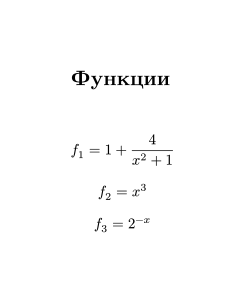

# Сборка многомодульных программ. Вычисление корней уравнений и определенных интегралов.

В рамках задания требовалось с определенной точностью вычислить площадь
замкнутой фигуры, ограниченной тремя кривыми (заданы с помощью функций).

Вычисления значений функций требовалось выполнять с помощью языка ассемблера
NASM, а вычисление интегралов - на языке C, то есть, этот проект демонстрирует
пример совместного использования NASM и C в рамках одной программы.

## Сборка

В проекте используется NASM для архитектуры IA-32. Поэтому для сборки нужно поставить соответствующие зависимости.

### Nix (рекомендуется)

Если у Вас есть Nix, после клонирования репозитория в корне проекта запустите:

```sh
nix-shell --pure
```

Вся необходимая настройка окружения будет выполнена автоматически.

### Fedora

```sh
sudo dnf install gcc nasm make glibc-devel.i686 libgcc.i686
```

### Debian

```sh
sudo apt install gcc nasm make gcc-multilib
```

Собрать проект можно с помощью Makefile:

```sh
make all
```

В результате сборки в корне проекта должен оказаться исполняемый файл
`integral`.

## Опции

Полный список опций доступен при использовании `-h` (или `--help`):

```sh
./integral --help
```

Вывод:

```
Справка
	-h, --help - вывести это сообщение
	-r, --root - напечатать абсциссы точек пересечения кривых
	-i, --iterations - напечатать число итераций, потребовавшихся на приближенное решение уравнений при поиске точек пересечения
	-R, --test-root F1:F2:A:B:E:R, где F1, F2 — номера используемых функций, A, B, E — значения параметров a, b, eps1 функции root, R - правильный ответ - протестировать функцию root
	-I, --test-integral F:A:B:E:R, где F — номер используемой функции, A, B, E — значения параметров a, b, eps2 функции integral, R — правильный ответ - протестировать функцию integral
```

Примечение. `A`, `B` - концы отрезка, в пределах которых ищутся корни или
выполняется интегрирование; `eps` - точность вычислений.

### Примеры использования

### Ответ на задачу (площадь фигуры, ограниченной кривыми):

```sh
./integral
```

```
6.591105
```

### Абсциссы перечений

```sh
./integral -r
```

```
Абсциссы пересечений:
	x1 - -1.307861
	x2 - 0.826218
	x3 - 1.343651
```

### Тестирование поиска корня

```sh
./integral -R 1:2:1:3:0.0001:1.3437
```

```
1.343651 0.000049 0.000037
```

(Программа вызывает функцию `root` с указанными параметрами, сравнивает
результат с правильным ответом и выводит полученный результат,
абсолютную и относительную ошибку)

### Тестирование нахождения определенного интеграла

```sh
/integral -I 1:-1:1:0.0001:8.2832
```

```
8.283185 0.000015 0.000002
```

## Вариант задания

| Параметр варианта                      | Номер                              |
| -------------------------------------- | ---------------------------------- |
| Уравнения кривых                       | 10 (Приведены ниже)                |
| Методы приближенного решения уравнений | 1 (Метод деления отрезков пополам) |
| Квадратурные формулы                   | 3 (Формула Симпсона)               |


